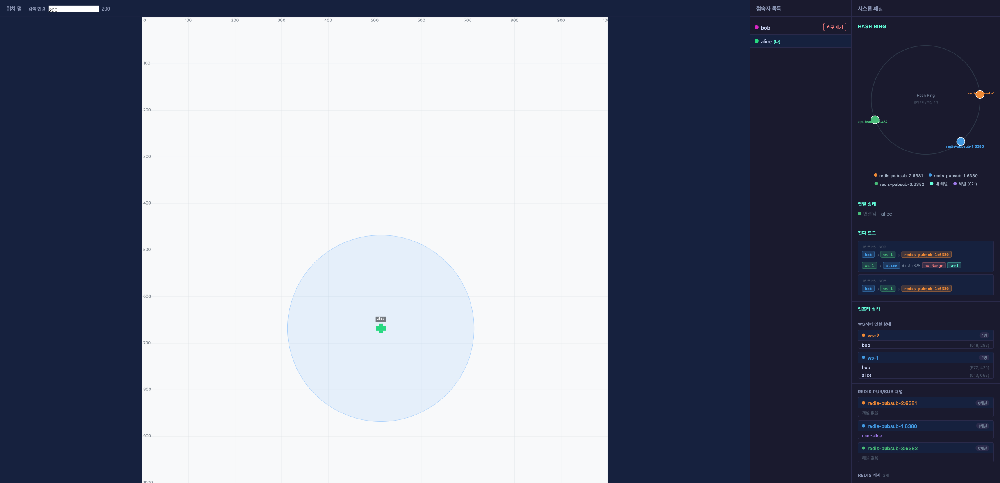
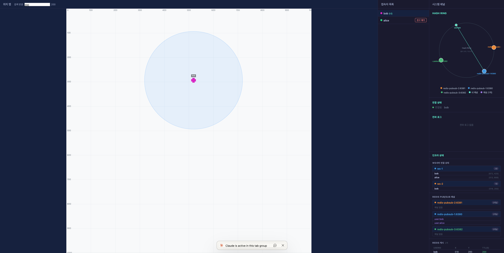
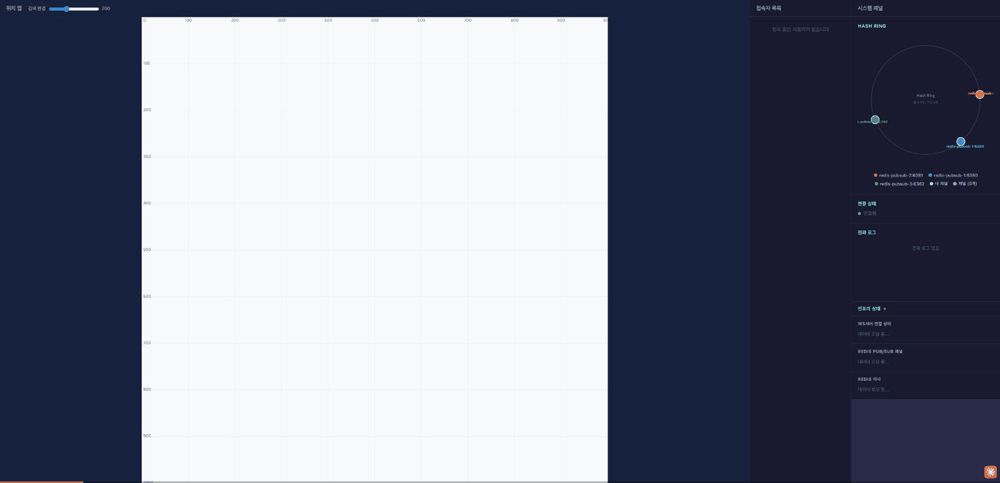

# Nearby Friends — 분산 시스템 직접 구현 프로젝트

> Alex Xu의 "가상 면접 사례로 배우는 대규모 시스템 설계 기초 2" — Nearby Friends 챕터를 Docker로 직접 구현하고, 내부 동작을 실시간으로 시각화한 학습 프로젝트입니다.

---

## 왜 만들었나

책에서 아키텍처 다이어그램을 읽는 것과 직접 코드를 짜는 것은 전혀 다른 경험입니다.

"Consistent Hash Ring으로 Redis Pub/Sub 채널을 분산한다"는 문장은 이해하기 어렵지 않습니다. 그런데 막상 구현하려고 하면 질문이 생깁니다. publish는 Hash Ring으로 노드를 하나 결정해서 보내는데, subscribe는 어떻게 해야 할까요? 친구가 어느 Redis 노드에 publish할지 수신 측은 알 수 없습니다. 그래서 모든 WS 서버가 모든 Redis 노드를 구독해야 한다는 것을 직접 구현하면서 처음으로 체감했습니다.

저는 이 과정을 눈으로 확인하고 싶었습니다.

> **메시지가 어떤 경로로 흘러가는지 — 어떤 WS 서버에서 받아서, 어떤 Redis 노드를 통해, 누구에게 전달됐는지 — 화면에서 직접 본다.**

---

## 핵심 학습 포인트

### 1. Pub/Sub 비대칭성 — 이 프로젝트의 핵심

처음에는 publish와 subscribe를 대칭으로 설계하려 했습니다. Hash Ring으로 노드를 결정하면 publish도, subscribe도 같은 노드를 쓰면 되지 않을까 생각했습니다.

그런데 subscribe는 그렇게 할 수 없습니다. alice가 bob을 친구로 추가했을 때, bob이 나중에 위치를 업데이트하면 그 메시지는 Hash Ring이 결정한 임의의 Redis 노드로 publish됩니다. alice가 연결된 WS 서버는 그 노드가 어느 것인지 미리 알 수 없습니다. 따라서 모든 Redis 노드를 구독하는 수밖에 없습니다.

```
Publish:   Hash Ring → 1개 노드만 결정 → 해당 노드에만 publish
Subscribe: 모든 WS 서버가 모든 Redis 노드를 subscribe
```

이 비대칭성이 성립해야 서로 다른 WS 서버에 연결된 두 사용자 사이의 위치 전파가 가능합니다.

### 2. Consistent Hash Ring — 왜 단순 modulo를 쓰면 안 되는가

`user:bob` 채널을 `hash(channel) % N`으로 노드에 배정하면 간단합니다. 다만, Redis 노드를 하나 추가하거나 제거할 때 거의 모든 채널이 다른 노드로 재배정됩니다. 기존에 subscribe 중이던 채널이 전부 바뀌는 셈입니다.

Consistent Hash Ring은 이 재배치를 최소화합니다. 노드가 추가되면 인접한 범위의 채널만 이동합니다.

구현 내용은 다음과 같습니다.

- 해시 함수: MurmurHash3 128bit (Guava) — MD5보다 3~5배 빠르고 분포가 균일합니다.
- 자료구조: `TreeMap<Long, String>` + `ceilingEntry()` — O(log N)으로 시계 방향 인접 노드를 탐색합니다.
- 가상 노드: 물리 노드당 3개로 설정했습니다. 운영 환경에서는 100~150개가 권장되지만, 이 프로젝트에서는 Hash Ring 다이어그램의 가독성을 위해 의도적으로 작게 유지했습니다.

### 3. Spring Boot 멀티 Redis 인스턴스 — auto-configuration의 한계

`spring.data.redis.*` auto-configuration은 Redis 인스턴스가 하나라는 전제로 동작합니다. Pub/Sub 노드 3개를 독립적으로 관리하려면 auto-configuration을 비활성화하고 Bean을 직접 구성해야 합니다.

```java
// RedisConfig.java
// spring.data.redis.repositories.enabled=false 설정 후 수동 구성
List<LettuceConnectionFactory> pubsubConnectionFactories;
List<StringRedisTemplate>      pubsubTemplates;
List<RedisMessageListenerContainer> pubsubContainers;
```

처음에는 auto-configuration을 켜둔 채로 Bean을 추가했는데, `@Primary` Bean 충돌로 애플리케이션이 뜨지 않았습니다. auto-configuration을 완전히 끄고 모든 Bean을 수동으로 정의하는 방식으로 해결했습니다.

### 4. Lettuce EventLoop 스레드 블로킹 금지

Redis Pub/Sub 콜백은 Lettuce 내부의 EventLoop 스레드에서 실행됩니다. 이 스레드에서 블로킹 호출(DB 조회, 동기 Redis 명령어)을 하면 다른 모든 Pub/Sub 메시지 처리가 중단됩니다.

```java
// LocationWebSocketHandler.java
messageListenerContainer.addMessageListener((message, pattern) -> {
    // EventLoop에서 즉시 별도 스레드풀로 위임
    locationHistoryExecutor.execute(() -> handleLocationMessage(message));
}, channelTopic);
```

사실 이 제약은 처음에 명확히 인지하지 못했습니다. Lettuce 문서를 보고 나서야 콜백 내 블로킹 호출이 얼마나 위험한지 이해했고, 이후 모든 Pub/Sub 콜백에서 블로킹 작업을 별도 executor로 분리했습니다.

### 5. 트랜잭션 커밋 후 Pub/Sub 구독

친구를 추가할 때 PostgreSQL 트랜잭션이 커밋되기 전에 Redis 채널을 subscribe하면, 트랜잭션이 롤백됐을 때 불필요한 구독이 남습니다. `TransactionSynchronization.afterCommit()`을 사용하면 커밋이 확정된 이후에만 구독이 시작됩니다.

```java
// FriendService.java
TransactionSynchronizationManager.registerSynchronization(
    new TransactionSynchronization() {
        @Override
        public void afterCommit() {
            pubSubManager.subscribe("user:" + friendId, listener);
        }
    }
);
```

---

## 구현한 것

### 인프라 (Docker Compose, 컨테이너 10개)

```
Frontend :3000 (React + TypeScript)
    │
    ▼
Nginx :80
  ├── /ws/  → WebSocket round-robin
  └── /api/ → REST routing
       │
       ├── ws-server-1 :8081
       └── ws-server-2 :8082   (Spring Boot 3.4.3 / Java 21)
            │
            ├── Redis Cache    :6379  (최신 위치 + TTL)
            ├── Redis PubSub-1 :6380
            ├── Redis PubSub-2 :6381
            ├── Redis PubSub-3 :6382
            ├── PostgreSQL     :5432  (users, friendships)
            └── Cassandra      :9042  (위치 이력)
```

`docker compose up` 한 번으로 전체 인프라가 구동됩니다. `depends_on: condition: service_healthy`를 사용해 Redis, PostgreSQL, Cassandra가 준비된 이후에 WS 서버가 뜨고, WS 서버가 준비된 이후에 Nginx가 시작되도록 순서를 보장했습니다.

### Backend

| 모듈 | 역할 |
|------|------|
| `ConsistentHashRing` | MurmurHash3 + TreeMap으로 채널 → Redis 노드 매핑 |
| `RedisPubSubManager` | publish는 1개 노드, subscribe는 모든 노드 |
| `LocationWebSocketHandler` | WebSocket 연결 관리 + 위치 업데이트 병렬 처리 |
| `UserEventService` | `system:user-events` 채널로 분산 접속자 상태 동기화 |
| `FriendService` | 트랜잭션 커밋 후 Pub/Sub 채널 구독 |
| `LocationHistoryService` | Cassandra에 위치 이력 비동기 저장 |

위치 업데이트 수신 시 다음 세 가지를 병렬로 처리합니다.

1. Cassandra에 이력 저장 — `@Async`, 별도 `locationHistoryExecutor`
2. Redis Cache 현재 위치 갱신 + TTL 리셋
3. Consistent Hash Ring으로 노드 결정 → Redis Pub/Sub publish

### Frontend

| 컴포넌트 | 역할 |
|----------|------|
| `LocationCanvas` | Canvas + `requestAnimationFrame`, 도트 캐릭터 드래그, Retina 대응 |
| `HashRingDiagram` | 순수 SVG + React로 Hash Ring 시각화 (D3.js 미사용) |
| `PropagationLogPanel` | 메시지 전파 경로 실시간 표시 |
| `InfraStatusPanel` | WS 서버 연결 현황 + Redis 채널/캐시 상태 폴링 |
| `UserListPanel` | 접속자 목록 + 친구 추가/제거 |
| `useWebSocket` | native WebSocket + exponential backoff 재연결 |

Hash Ring 시각화에는 D3.js를 사용하지 않았습니다. 노드 수가 많지 않아 `<circle>`, `<line>`, `<text>` 같은 기본 SVG 엘리먼트로 직접 구현해도 충분했고, 외부 라이브러리 없이 React 상태만으로 인터랙션을 처리하는 편이 더 단순했습니다.

---

## 실제 작동 화면

### 메인 화면 — alice 시점

오른쪽 패널에서 Hash Ring, 전파 로그, 인프라 상태를 실시간으로 확인할 수 있습니다. bob이 이동하면 `bob → ws-1 → redis-pubsub-1:6380` 전파 경로가 즉시 기록됩니다.



### 멀티유저 — bob 시점

bob이 접속하면 alice의 채널이 Redis에 등록되고, 서로의 위치가 Canvas에 표시됩니다. bob을 드래그하면 alice 화면의 전파 로그에 경로와 거리가 함께 기록됩니다.



### 전파 경로 로그

```
alice → ws-2 → redis-pubsub-1:6380
ws-2  → bob   dist:375  outRange  sent
```

alice가 이동한 위치가 bob의 검색 반경(200) 밖이면 `outRange`로 표시되고, 반경 안으로 들어오면 `inRange`로 바뀌면서 Canvas에서 상대 캐릭터가 보이기 시작합니다.

### 데모



---

## 실행

```bash
docker compose up
# http://localhost
```

---

## 기술 선택

| 선택 | 대안 | 이유 |
|------|------|------|
| Raw WebSocket | STOMP | Redis Pub/Sub가 브로드캐스트를 담당하므로 STOMP 내장 브로커와 역할이 중복됩니다. |
| Lettuce | Jedis | 스레드 안전하고 Spring Boot 3.x 기본 탑재입니다. 다중 인스턴스 연결 시 connection pool 없이 동작합니다. |
| MurmurHash3 | MD5 | 암호학적 보안이 불필요한 채널 라우팅에 MD5는 과도합니다. MurmurHash3가 3~5배 빠르고 분포도 균일합니다. |
| Cassandra | TimescaleDB | Alex Xu 책과 동일한 구성으로 write-heavy 워크로드를 직접 체감하기 위해 선택했습니다. |
| 순수 SVG + React | D3.js | 노드 수가 적어 SVG로 충분했고, 외부 의존성을 추가할 이유가 없었습니다. |
| Canvas + `requestAnimationFrame` | `setInterval` | `setInterval`은 프레임 드랍과 불안정한 애니메이션을 유발합니다. |

---

## 참고

- Alex Xu, "가상 면접 사례로 배우는 대규모 시스템 설계 기초 2", Chapter 18 Nearby Friends
